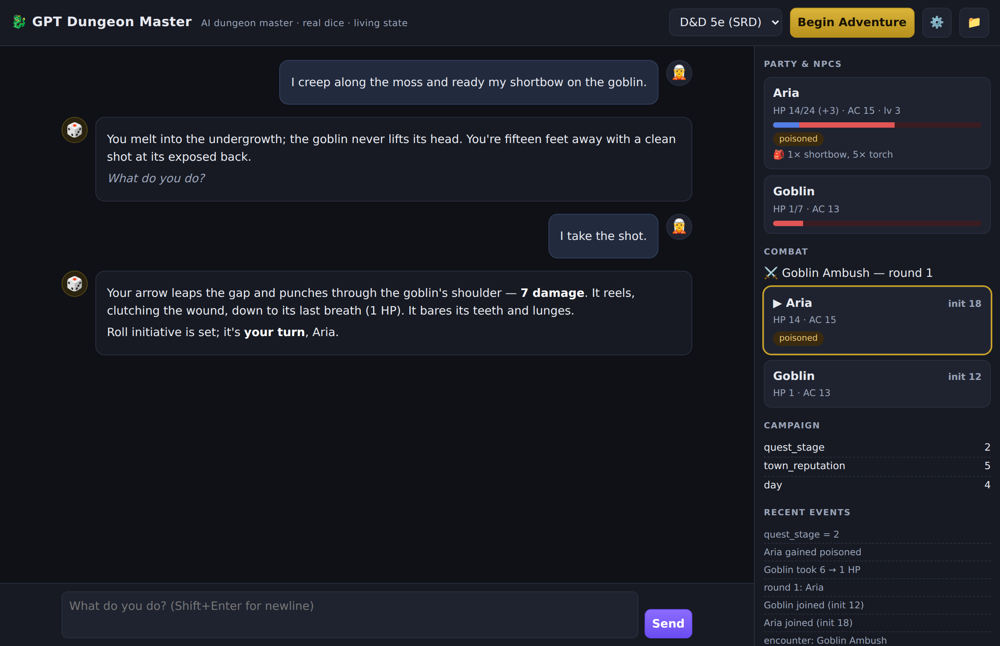
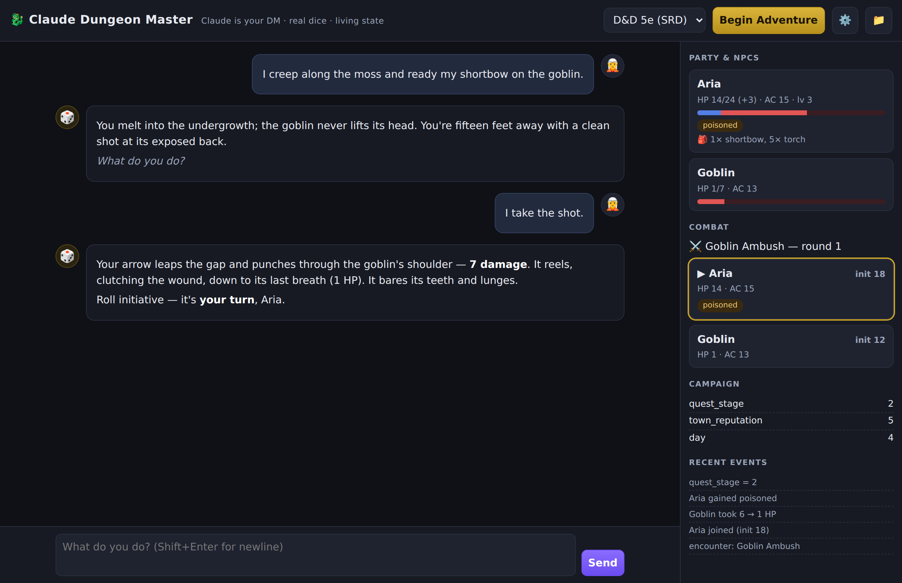

# 🐉 GPT Dungeon Master — web app

A **single self-contained HTML file** that plays D&D-style RPGs with an AI as
Dungeon Master, right in your browser. No build step, no server, no dependencies.

Two builds, same engine and UI — pick by which model you want as DM:

| File | DM provider | Key | Default model |
|------|-------------|-----|---------------|
| [`dnd-dm.html`](dnd-dm.html) | Any **OpenAI-compatible** Chat Completions API (OpenAI, OpenRouter, local) | `sk-…` | `gpt-4o` |
| [`dnd-dm-claude.html`](dnd-dm-claude.html) | **Claude** (Anthropic Messages API) | `sk-ant-…` | `claude-opus-4-8` |

> **Claude build:** uses the Anthropic Messages API with adaptive thinking; Claude
> calls the dice/combat tools itself via Anthropic tool-use. Browser calls are
> enabled with the `anthropic-dangerous-direct-browser-access` header, so no proxy
> is needed. Get a key at console.anthropic.com. It keeps its own campaigns/settings
> namespace, so it won't clash with the OpenAI build. 

The AI narrates and judges; the page's built-in engine owns the mechanics, so
**dice, hit points, initiative, conditions, and inventory are real, not
hallucinated.** It's the kit's `dm_tools.py` engine and `tool-schemas.json`
ported to JavaScript, wired to an LLM via function calling.

## Use it
1. Open `dnd-dm.html` in any modern browser (double-click it).
2. Click **⚙️** and enter an **OpenAI-compatible API key**. Also works with:
   - OpenAI — base `https://api.openai.com/v1`, model `gpt-4o`
   - OpenRouter — base `https://openrouter.ai/api/v1`
   - Local (LM Studio / Ollama) — base `http://localhost:1234/v1`
3. Pick a **ruleset** (5e SRD, Rules-Lite d20, or Custom) and press
   **Begin Adventure**. The DM runs a quick Session Zero, makes your character,
   and opens with a hook.
4. Type what you do. Watch the right-hand panel update as the AI calls tools.

Your key and campaigns are stored only in your browser (`localStorage`). Use the
**📁** menu to name/switch campaigns, or **export/import** a campaign as JSON.

## What's on screen
- **Left** — the story: your messages, the DM's narration, and a chip for every
  tool the AI calls (`🎲 1d20`, `🎯 … vs DC ✓`, `💥 −6 → 14 HP`, …).
- **Right** — live state straight from the engine: party/NPC HP bars and temp HP,
  conditions, inventory, the initiative tracker (current turn highlighted),
  campaign variables, and a recent-events log.

## How it relates to the rest of the kit
This is the no-install, fully-automated counterpart to the CLI / API / MCP paths
in [`../guide/`](../guide). It embeds condensed versions of
[`../instructions/DM_SYSTEM_PROMPT.md`](../instructions/DM_SYSTEM_PROMPT.md) and
the [`../sources/system-modules/`](../sources/system-modules) modules, and mirrors
the 17 tools in [`../tools/tool-schemas.json`](../tools/tool-schemas.json).

> Browser calls require the API endpoint to allow CORS (OpenAI, OpenRouter, and
> most local servers do). The 5e module paraphrases the SRD © Wizards of the
> Coast under CC-BY-4.0; this app is unofficial.
